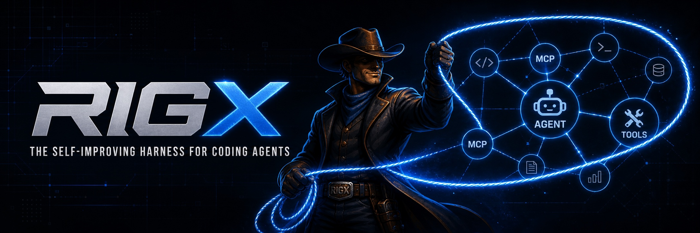

<div align="center">



### The self-improving harness for coding agents.

**Local-first harness engineering for Claude Code, Codex, and the agent tools that come next.**

[](https://github.com/Sabeekhann/RigX/actions/workflows/ci.yml)
[](https://github.com/Sabeekhann/RigX/actions/workflows/security.yml)
[](https://codecov.io/gh/Sabeekhann/RigX)
[](LICENSE)
[](package.json)
[](ROADMAP.md)

</div>

---

## Why RIGX?

Coding agents are getting better quickly, but the environment around them is still mostly hand-built: `AGENTS.md`, `CLAUDE.md`, skills, hooks, MCP configuration, verification commands, architecture docs, permissions, and recovery workflows.

When an agent struggles, the usual response is to add another instruction. That creates larger context, duplicated rules, stale guidance, and no reliable way to know whether the harness actually improved.

**RIGX treats the harness as an engineering system that can be inspected, versioned, measured, and eventually improved.**

```text
coding agent
    │
    ▼
┌─────────────────────────────────────────┐
│                  RIGX                   │
│                                         │
│  instructions  skills   hooks   MCP     │
│  docs          tests    policy  context │
│  snapshots     evidence verification    │
└─────────────────────────────────────────┘
    │
    ▼
observe → diagnose → propose → evaluate → evolve
```

RIGX does **not** replace Claude Code or Codex. It improves the system around them.

## Current alpha

The current implementation is deliberately small and deterministic. It establishes the privacy and reproducibility foundation needed before richer session observation is added.

| Command | What it does |
| --- | --- |
| `rigx init [path]` | Creates an explicit local RIGX privacy/config boundary. |
| `rigx doctor [path]` | Audits a repository harness and reports evidence-backed gaps. |
| `rigx agents` | Detects local Claude Code and Codex data surfaces without parsing transcript contents in strict mode. |
| `rigx privacy [path]` | Shows the active privacy guarantees. |
| `rigx observe --agent <claude-code|codex>` | Normalizes explicitly supplied structured agent events without persisting raw content. |
| `rigx snapshot [path]` | Creates a content-free SHA-256 baseline of harness surfaces. |
| `rigx status [path]` | Reports harness drift against the baseline. |

### What `doctor` inspects today

- repository-level agent instructions
- skill directories
- hook surfaces
- MCP configuration surfaces
- CI workflows
- package verification commands
- architecture/documentation signals
- duplicated durable instructions where deterministic evidence exists
- RIGX privacy initialization

RIGX distinguishes **facts** from **recommendations** and avoids claims such as “stale” or “unused” unless it has evidence to support them.

## Quick start

RIGX is currently an alpha source release and is **not yet published to npm**.

```bash
git clone https://github.com/Sabeekhann/RigX.git
cd RigX
npm ci
npm test
npm link
```

Then, from any repository:

```bash
rigx init .
rigx doctor .
rigx snapshot .
rigx status .
```

Machine-readable output is available where useful:

```bash
rigx doctor . --json
rigx agents --json
rigx privacy . --json
rigx snapshot . --json
rigx status . --json
```

Structured observation is explicit and stream-based. For example:

```bash
printf '%s\n' '{"hook_event_name":"SessionStart","session_id":"example"}' \
  | rigx observe --agent claude-code --json
```

RIGX emits only the normalized strict-mode event fields and does not persist the raw input.

## Example

```text
$ rigx doctor .

RIGX Doctor
────────────────────────────────────────
Harness score: 82/100

WARNING  verification
Missing deterministic test script
Evidence: package.json has no test script
Recommendation: expose the repository's canonical test command as a package script.

INFO     instructions
Repository instruction surface detected
Evidence: AGENTS.md
```

Output evolves during alpha development; examples are illustrative rather than a stable CLI contract.

## Privacy by design

The default mode is **`strict`**.

In strict mode RIGX does not persist:

- raw prompts
- model responses
- source code
- terminal output
- full paths from observed agent sessions

The current core CLI contains no product telemetry and makes no network requests. Agent detection checks filesystem metadata only. Harness snapshots store relative harness file names, byte counts, and SHA-256 hashes — **not file contents**.

```text
NO ACCOUNT REQUIRED
NO TELEMETRY
NO SOURCE UPLOADS
NO PROMPT UPLOADS
NO SESSION UPLOADS
```

Read the full policy in [PRIVACY.md](PRIVACY.md).

## Harness snapshots

RIGX turns harness configuration into a versionable engineering artifact:

```bash
rigx snapshot .
```

The committed baseline lives at:

```text
.rigx/harness.lock.json
```

The lock records hashes of relevant instruction, skill, hook, workflow, and configuration surfaces. It intentionally does not contain their raw contents.

After changing the harness:

```bash
rigx status .
```

RIGX reports which harness surfaces were added, removed, or changed.

## Agent support

| Agent | Current support | Direction |
| --- | --- | --- |
| Claude Code | Local surface detection + structured event normalization | Direct hook adapter |
| OpenAI Codex | Local surface detection + structured event normalization | Direct event adapter |
| Cursor | Harness surface discovery | Adapter planned |
| OpenCode | Architecture supports adapters | Adapter planned |
| Other agents | Vendor-neutral core | Community adapters planned |

Vendor-specific formats stay behind adapters. The core must not depend on one provider's internal transcript schema.

## What comes next

The product direction is a full harness-improvement loop:

```text
real agent work
     ↓
structured local signals
     ↓
repeated failure / waste patterns
     ↓
harness improvement proposal
     ↓
isolated evaluation
     ↓
promote proven improvement or reject regression
```

Planned capabilities include:

- repeated-search and repeated-failure detection
- skipped-verification detection
- context/harness waste signals
- reviewable skill, hook, instruction, and documentation proposals
- isolated worktree A/B evaluation
- baseline-vs-candidate harness comparison
- user-approved harness evolution

See [ROADMAP.md](ROADMAP.md) for the staged plan.

## Design principles

1. **Local first.** Core analysis works without a cloud account.
2. **Evidence before judgement.** Findings must explain why they fired.
3. **Deterministic before probabilistic.** Use normal software checks when they can answer the question.
4. **Privacy is architectural.** Sensitive collection is not silently enabled.
5. **Vendor-neutral core.** Claude Code, Codex, and future agents are adapters.
6. **Propose before mutate.** Harness improvements are reviewable changes, not silent rewrites.
7. **Measure improvements.** “Better” should eventually mean demonstrably better on real repository work.

## Repository layout

```text
RigX/
├── src/
│   ├── adapters/       # vendor boundaries
│   ├── commands/       # CLI commands
│   └── core/           # deterministic analysis/snapshot logic
├── test/               # Node test runner suite
├── scripts/            # repository quality helpers
├── docs/               # architecture and product design
├── .github/            # CI, security and community automation
├── .rigx/              # this repo's own RIGX harness baseline
├── AGENTS.md            # authoritative agent/contributor rules
├── PRIVACY.md
├── ROADMAP.md
└── SECURITY.md
```

## Development

Requirements:

- Node.js 22+
- npm

```bash
npm ci
npm run check
npm run package:check
```

The runtime intentionally has **zero third-party dependencies** in the current alpha.

CI includes required tests/package validation, cross-platform compatibility, Codecov coverage, dependency review, CodeQL, gitleaks, and production dependency auditing. See [docs/CI.md](docs/CI.md).

## Contributing

Contributions are welcome. Please read [CONTRIBUTING.md](CONTRIBUTING.md) and [AGENTS.md](AGENTS.md) before changing the project.

For substantial behavior changes, open an issue first so the privacy and harness-model implications can be discussed before implementation.

## Security

Please do not report vulnerabilities in public issues. See [SECURITY.md](SECURITY.md) for the private reporting path and supported-version policy.

## Project status

RIGX is **alpha software**. Schemas, command output, package metadata, and internal APIs can change before the first stable release. It is suitable for experimentation and contribution, not yet for depending on as a stable automation contract.

## License

Apache License 2.0. See [LICENSE](LICENSE) and [NOTICE](NOTICE).
